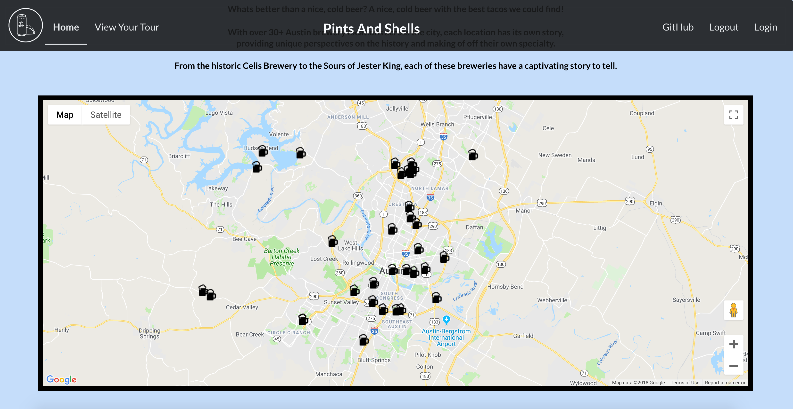
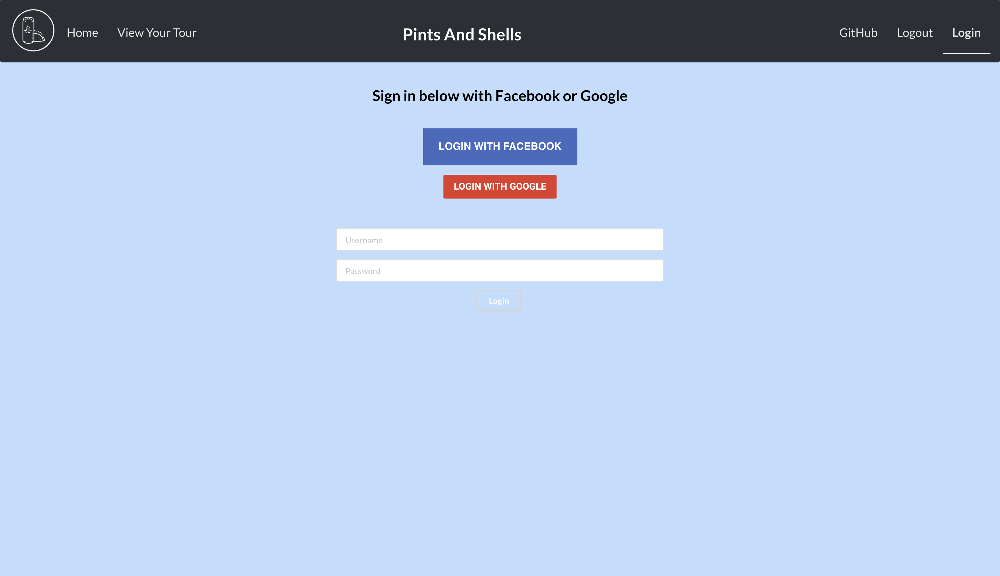
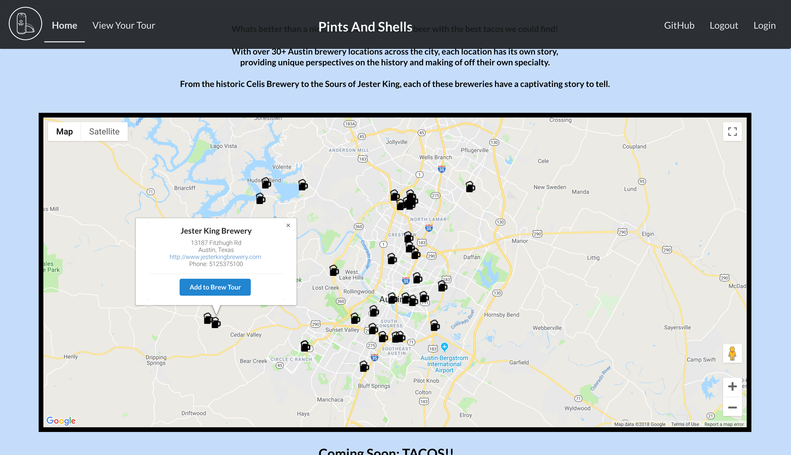
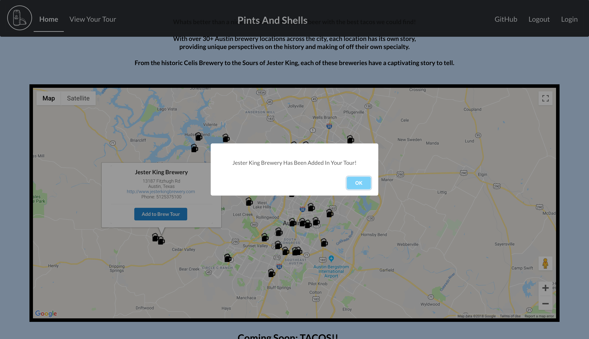
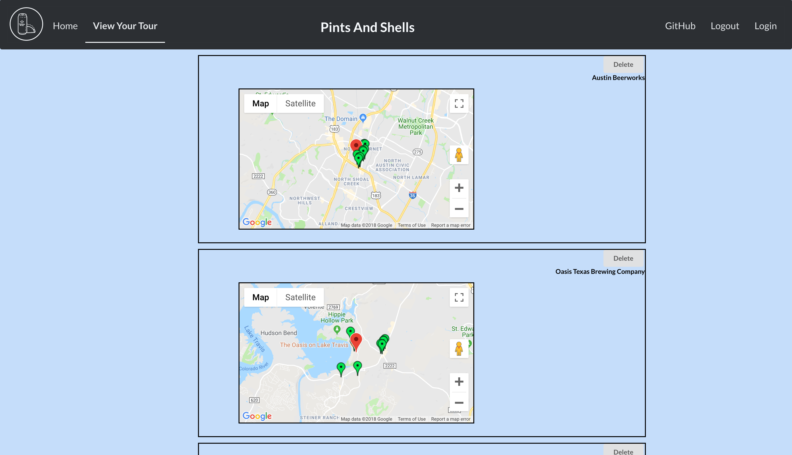

# Pints-Shells
A User-friendly platform to locate breweries in and around Austin, TX and also give locations to nearby places to get tacos.

## Link to Site

## Languages Used
- HTML
- CSS
- JavaScript
- JSX
- Mongoose

## APIs Used:
- Open Brewery DB
- Google Maps API
- Google Places API
- Google Login
- Facebook Login

### Front-End
- React

### Back-End
- Node
- Express
- MongoDB

## Stretch Goals:
- Give location of places to get tacos within short distance of each brewery
- User feedback on breweries
- Create a User profile

